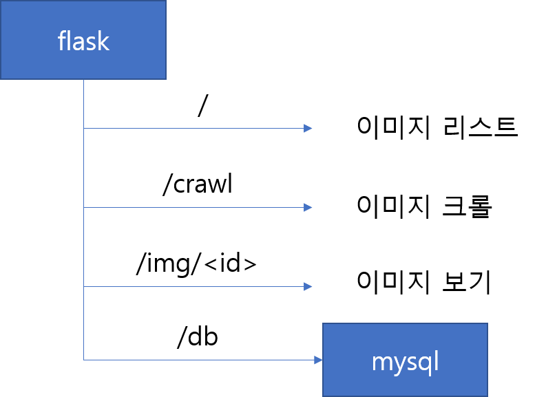

# docker 실행 고급

도커 실행시 몇가지 옵션들을 조금 더 소개합니다.

#### 1. Network

지금까지 nginx 실행시, 컨테이너 내부에서 동작을 확인하였습니다. (`curl localhost`) 이것을 로컬 서버 포트와 연결시켜 실행해 보도록 하겠습니다.

```bash
# docker run -p $HOST_PORT:$CONTAINER_PORT $IMG
# 호스트의 5000번 포트를 컨테이너의 80포트와 매핑합니다.
docker run -p 5000:80 nginx
# /docker-entrypoint.sh: /docker-entrypoint.d/ is not empty, will attempt to perform configuration
# /docker-entrypoint.sh: Looking for shell scripts in /docker-entrypoint.d/
# /docker-entrypoint.sh: Launching /docker-entrypoint.d/10-listen-on-ipv6-by-default.sh
# 10-listen-on-ipv6-by-default.sh: Getting the checksum of /etc/nginx/conf.d/default.conf
# 10-listen-on-ipv6-by-default.sh: Enabled listen on IPv6 in /etc/nginx/conf.d/default.conf
# /docker-entrypoint.sh: Launching /docker-entrypoint.d/20-envsubst-on-templates.sh
# /docker-entrypoint.sh: Configuration complete; ready for start up
```

> 종료: <CTRL> + <C>

다시 백그라운드로 실행합니다. (`-d` 옵션)

```bash
docker run -p 5000:80 -d nginx

# 내부 IP로 접근 시
hostname -i
# 외부 IP로 접근 시
curl ifconfig.co

# 5000번으로 curl 호출을 합니다.
curl <내부 혹은 외부IP>:5000
```

이번에는 내부 혹은 외부 IP를 이용하여 직접 웹 브라우저에 입력합니다.

> 웹 브라우저 URL: `$IP:5000`

이를 통해 외부 트레픽을 컨테이너 내부까지 전달할 수 있게 됩니다.

#### 2. Volume

이미지 실행시, 네트워크 연결뿐만 아니라 로컬의 파일시스템을 컨테이너와 연결할 수 있습니다.

```bash
# docker run -v $HOST_DIR:$CONTAINER_DIR $IMG
# 현재 디렉토리를 컨테이너의 nginx 디렉토리와 연결합니다.
docker run -p 6000:80 -v $(pwd):/usr/share/nginx/html/ -d nginx

# 현재 디렉토리에 hello.txt 파일을 생성합니다.
echo hello! >> $(pwd)/hello.txt
# nginx 내부에서 해당 파일이 보이는지 확인합니다.
curl <내부 혹은 외부IP>:6000/hello.txt
# hello!
```

변경 사항이 많은 파일의 경우, 컨테이너 내부에 파일을 두지 않고 호스트 서버의 디렉토리를 연결하여, 호스트 서버에서 조금 더 손쉽게 파일을 수정할 수 있습니다. 또한 컨테이너는 컨테이너 종료시, 저장된 데이터가 사라지지만 볼륨을 이용하여 데이터를 저장하는 경우 데이터가 유실되지 않고 유지되는 장점이 있습니다.

#### 3. User

이번에는 Dockerfile의 `USER` 지시자에 대해서 살펴보고 이를 override하는 방법을 알아보겠습니다.

기본적으로 컨테이너의 유저는 root입니다. 하지만 보안상의 이유로 root가 아닌 일반 유저를 사용하도록 만들 수 있습니다.

```Dockerfile
FROM ubuntu:18.04

# Ubuntu 유저 생성
RUN adduser --disabled-password --gecos "" ubuntu

# 컨테이너 실행시 ubuntu로 실행
USER ubuntu
```

```bash
# my-user 라는 이미지 생성
docker build . -t my-user

# ubuntu라는 유저로 컨테이너 실행
docker run -it my-user bash
# ubuntu@b09ce82d4a77:/$

ubuntu@b09ce82d4a77:/$ apt update
# Reading package lists... Done
# E: List directory /var/lib/apt/lists/partial is missing. - Acquire (13: Permission denied)
```

ubuntu는 root 유저가 아니기 때문에 root 권한이 필요한 `apt` 사용하게 되면 퍼미션 에러가 발생합니다. 하지만 도커를 실행시 `--user` 옵션을 이용하여 명시적으로 유저를 입력할 수 있습니다.

```bash
# 강제로 root 유저 사용
docker run --user root -it my-user bash
root@0ac2522215e8:/# apt update
# Get:1 http://security.ubuntu.com/ubuntu bionic-security InRelease [88.7 kB]
# Get:2 http://archive.ubuntu.com/ubuntu bionic InRelease [242 kB]
# ...
```

#### Clean up

```bash
docker stop $(docker ps -aq)
docker rm $(docker ps -aq)
```

---
 
## :trophy: Do it more #1

다음과 같은 mysql 앱을 실행해주세요.

- 이미지 URL: `mysql`
- 사용할 포트: `3306`
- 필요한 환경변수
  - `MYSQL_ROOT_PASSWORD`: `root` 비밀번호
  - `MYSQL_USER`: 일반유저 이름
  - `MYSQL_PASSWORD`: 일반유저 비밀번호 


```bash
hostname -i
# 172.168.4.1 (내부 IP)

# 일반유저: ubuntu / 비밀번호: 1234 가정
$ mysql -h $(hostname -i) -u ubuntu -p 1234
```

## :trophy: Do it more #2

다음과 같이 동작하는 flask app을 만들 예정입니다.

- `/`: 이미지 리스트를 출력합니다.
- `/crawl`: 인터넷에서 랜덤 이미지를 크롤링합니다.
- `/img/<id>`: 선택한 이미지를 보여줍니다.
- `/db`: DB와 연결하여 정보를 출력합니다.



#### app.py

```python
# app.py
import requests
import os, sys
import datetime

import pymysql
from flask import Flask
from flask import send_file


app = Flask(__name__)
IMG_DIR = os.environ.get("IMG_DIR", "/tmp")


@app.route('/')
def hello():
    arr = []
    for i in os.listdir(IMG_DIR):
        arr.append("<li><a href='img/%s'>%s</a></li>" % (i, i))
    return "<ul>" + "".join(arr) + "</ul>"


@app.route('/crawl')
def crawl():
    name = datetime.datetime.now().strftime("%Y%m%d-%H%M%S.png")
    with open(os.path.join(IMG_DIR, name), "wb") as f:
        response = requests.get('https://picsum.photos/200/300', verify=False)
        f.write(response.content)
    return "Saved %s on %s\n" % (name, IMG_DIR)


@app.route('/img/<imgid>')
def img(imgid):
    filename = os.path.join(IMG_DIR, imgid)
    return send_file(filename)


def connection():
    host = os.environ['MYSQL_HOST']
    user = os.environ['MYSQL_USER']
    password = os.environ['MYSQL_PASSWORD']
    db = 'information_schema'
    conn = pymysql.connect(host=host, user=user, \
            password=password, db=db, \
            cursorclass=pymysql.cursors.DictCursor)

    return conn


@app.route('/db')
def db():
    conn = connection()
    cur = conn.cursor()
    cur.execute("SELECT TABLE_NAME FROM TABLES")
    result = cur.fetchall()
    return str(result)


if __name__ == '__main__':
    app.run(host='0.0.0.0', debug=True)
```

```bash
MYSQL_HOST=$(hostname -i) MYSQL_USER=ubuntu MYSQL_PASSWORD=1234 python app.py
```

#### Dockerfile

```Dockerfile
FROM python:3.7

RUN apt-get update
RUN pip install flask pymysql requests cryptography
COPY app.py .

CMD ["python", "-u", "app.py"]
```

## :trophy: Do it more #3

`Makefile`이란?

```Makefile
# Makefile
hello:
    echo hello

date-plz:
    date

do-all: hello date-plz
```

`Makefile` 작성 후 다음과 같이 명령을 실행해 봅니다.

```bash
ls
# Makefile

make hello
# hello

make date-plz
# Tue Oct 13 11:51:04 UTC 2020

make do-all
# hello
# Tue Oct 13 11:51:04 UTC 2020
```

이제 아래와 같이 동작하는 `Makefile`을 만들어 주세요.

```bash
# DB 컨테이너 시작
make start-db

# DB 컨테이너 종료 
make stop-db

# app 이미지 빌드
make build-app

# app 컨테이너 시작
make start-app

# app 컨테이너 종료 
make stop-app

# DB, app 컨테이너 시작
make start-all

# DB, app 컨테이너 종료
make stop-all
```


```Makefile
start-db:
        docker run --rm -e MYSQL_ROOT_PASSWORD=1234 -e MYSQL_USER=ubuntu -e MYSQL_PASSWORD=1234 -p 3306:3306 --name mysql -d mysql

stop-db:
        docker stop mysql

build-app:
        docker build . -t app

start-app:
        docker run --rm -e MYSQL_HOST=172.17.0.1 -e MYSQL_USER=ubuntu -e MYSQL_PASSWORD=1234 -p 5000:5000 --name app -d app

stop-app:
        docker stop app

start-all: start-db start-app

stop-all: stop-db stop-app
```